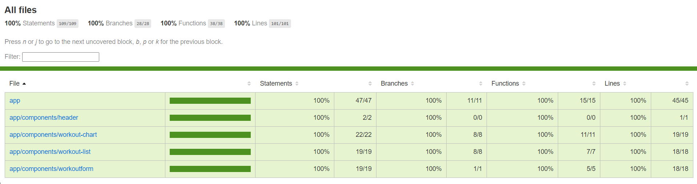

# Health Tracker 🏋️‍♂️

## 📌 Project Overview
Health Tracker is an Angular-based application designed to help users track their workouts efficiently. It includes features such as workout logging, visual progress tracking, and an intuitive user interface built with **Tailwind CSS**.

## 🚀 Features
- 📊 **Workout Tracking** - Log your daily workouts and exercises.
- 📈 **Workout Chart** - Visual representation of your progress.
- ✅ **Form Validation** - Ensures correct input in workout entries.
- 🎨 **Tailwind CSS Styling** - Modern and responsive design.
- 🔍 **100% Unit Test Coverage** - Ensuring reliability and quality.

## 🛠️ Technologies Used
- **Angular** - Frontend framework
- **Tailwind CSS** - Styling
- **Jasmine & Karma** - Unit testing

## 📦 Installation & Setup
### 1️⃣ Clone the Repository
```sh
git clone https://github.com/Ayushzxz/health-angular.git
```
### 2️⃣ Navigate to the Project Directory
```sh
cd health-angular
```
### 3️⃣ Install Dependencies
```sh
npm install
```
### 4️⃣ Run the Application
```sh
ng serve
```
The application will be available at `http://localhost:4200/`

## 🧪 Running Tests & Coverage
### Run Unit Tests
```sh
ng test
```
### Generate Test Coverage Report
```sh
ng test --code-coverage
```
The coverage report will be generated inside the `coverage/` folder.

## 📊 Test Coverage Report
This project has **100% test coverage** across all statements, branches, functions, and lines. Below is an example of the test coverage output:

```

```

## 🔗 Deployment (If applicable)
The app is deployed at: [Health Tracker](https://health-app-ayush.vercel.app/)

## 🤝 Contributing
Want to contribute? Follow these steps:
1. Fork the repository.
2. Create a feature branch (`git checkout -b feature-name`).
3. Commit your changes (`git commit -m "Added new feature"`).
4. Push to the branch (`git push origin feature-name`).
5. Open a pull request.

## 📜 License
This project is licensed under the **MIT License**.

## 📬 Contact
For any inquiries, feel free to contact me:
- **GitHub**: [Ayushzxz](https://github.com/Ayushzxz)
- **Email**: [ayushpandey121.work@gmail.com]

